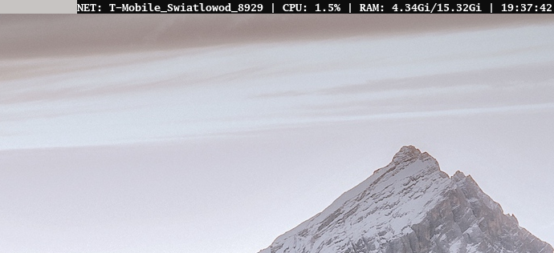

A slstatus alternative for dwl.



# Installation
```bash
git clone https://github.com/cyxap1255/dwlstatus
cd dwlstatus
make && sudo make install
```
# Uninstallation
```bash
cd dwlstatus
sudo make uninstall
rm dwlstatus
```
# Configuration
modules structure configuration file – modules/modules.c,
configuration file for modules displayed on the bar – dwlstatus.c

# Credits
Inspired by [suckless slstatus](https://github.com/drkhsh/slstatus).
